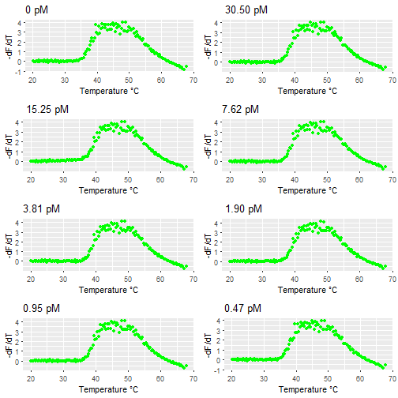

Melting curve analysis for diagnostics
--------------------------------------------------------------------------

Date: 2017-07-20 14:37:02
-----------------------------------------

Combined replicates plots (Fluoerescence vs Temperature):
---------------------------------------------------------

First derivative plots (dF/dT vs Temperature):
---------------------------------------------------------

Negative of first derivative plots (-dF/dT vs Temperature):
-------------------------------------------------------------------------------------------

Two- Gaussian fitting plots:
-------------------------------------------------------------------------------------------

Two- Gaussian fitting results:
-------------------------------------------------------------------------------------------

|      |      0 pM|  30.50 pM|  15.25 pM|   7.62 pM|   3.81 pM|   1.90 pM|   0.95 pM|   0.47 pM|
|:-----|---------:|---------:|---------:|---------:|---------:|---------:|---------:|---------:|
|Mean1 | 41.047437| 41.701913| 42.065825| 41.885857| 42.037460| 42.256977| 42.117585| 41.251252|
|SD1   |  2.921887|  2.695037|  2.670178|  2.596499|  2.605059|  2.632312|  2.648407|  2.901237|
|A1    |  2.477657|  2.291459|  1.991205|  2.202547|  2.211443|  2.191830|  2.253439|  2.466126|
|Mean2 | 49.187063| 49.313409| 49.286645| 49.310778| 49.392541| 49.467309| 49.401905| 49.178277|
|SD2   |  5.117313|  5.099483|  5.213217|  5.117808|  5.059018|  5.007396|  5.020735|  5.062067|
|A2    |  3.372003|  3.437863|  3.379329|  3.421989|  3.437319|  3.447811|  3.461340|  3.356320|

Gaussian means of temperature:
------------------------------------------------------------------------------------

|      |     0 pM|  30.50 pM|  15.25 pM|  7.62 pM|  3.81 pM|  1.90 pM|  0.95 pM|
|:-----|--------:|---------:|---------:|--------:|--------:|--------:|--------:|
|Mean1 | 41.04744|  41.70191|  42.06583| 41.88586| 42.03746| 42.25698| 42.11758|
|Mean2 | 49.18706|  49.31341|  49.28665| 49.31078| 49.39254| 49.46731| 49.40190|

95 percent confidence intervals of the Gaussian means of temperature:
------------------------------------------------------------------------------------

|           | min.value| max.value|
|:----------|---------:|---------:|
|conf.mean1 |  41.56740|  42.17918|
|conf.mean2 |  49.26772|  49.40647|

Plots of Gaussian Means vs Temperature:
------------------------------------------------------------------------------------

    
Settings used during implementation:
--------------------------------------------
Select the type of file:  .csv 

Name of plots on the basis of the COncentration:  0 pM, 30.50 pM, 15.25 pM,7.62 pM,3.81 pM, 1.90 pM,0.95 pM,0.47 pM 

initial values of m1,sd1,A1,m2,sd2 and A2 for 1st 2Gaussian plot:  44,1,3,53,1,3 

initial values of m1,sd1,A1,m2,sd2 and A2 for 2nd 2Gaussian plot:  44,1,3,53,1,3 

initial values of m1,sd1,A1,m2,sd2 and A2 for 3rd 2Gaussian plot:  44,1,3,53,1,3 

initial values of m1,sd1,A1,m2,sd2 and A2 for 4th 2Gaussian plot:  44,1,3,53,1,3 

initial values of m1,sd1,A1,m2,sd2 and A2 for 5th 2Gaussian plot:  44,1,3,53,1,3 

initial values of m1,sd1,A1,m2,sd2 and A2 for 6th 2Gaussian plot:  44,1,3,53,1,3 

initial values of m1,sd1,A1,m2,sd2 and A2 for 7th 2Gaussian plot:  44,1,3,53,1,3 

initial values of m1,sd1,A1,m2,sd2 and A2 for 8th 2Gaussian plot:  44,1,3,53,1,3 

Provide the reltol value:  2e-09 

Provide the method for Gaussian fitting:  BFGS 

Values of concentration:  0, 30.50, 15.25, 7.62, 3.81, 1.90,0.95 

Define the xlabel for the final plot:  Concentration (pM) 

Session Information:
--------------------------------------------
R version 3.4.0 (2017-04-21)
Platform: x86_64-w64-mingw32/x64 (64-bit)
Running under: Windows >= 8 x64 (build 9200)

Matrix products: default

locale:
[1] LC_COLLATE=English_United States.1252 
[2] LC_CTYPE=English_United States.1252   
[3] LC_MONETARY=English_United States.1252
[4] LC_NUMERIC=C                          
[5] LC_TIME=English_United States.1252    

attached base packages:
character(0)

other attached packages:
[1] AptaqPCR_0.1.0

loaded via a namespace (and not attached):
 [1] Rcpp_0.12.10        magrittr_1.5        knitr_1.15.1       
 [4] BiocGenerics_0.22.0 grDevices_3.4.0     munsell_0.4.3      
 [7] colorspace_1.3-2    xtable_1.8-2        R6_2.2.1           
[10] rlang_0.1.1         highr_0.6           stringr_1.2.0      
[13] plyr_1.8.4          tools_3.4.0         utils_3.4.0        
[16] parallel_3.4.0      grid_3.4.0          Biobase_2.36.2     
[19] gtable_0.2.0        htmltools_0.3.6     stats_3.4.0        
[22] datasets_3.4.0      lazyeval_0.2.0      digest_0.6.12      
[25] tibble_1.3.1        base_3.4.0          gridExtra_2.2.1    
[28] shiny_1.0.3         RColorBrewer_1.1-2  ggplot2_2.2.1      
[31] graphics_3.4.0      evaluate_0.10       mime_0.5           
[34] labeling_0.3        stringi_1.1.5       compiler_3.4.0     
[37] methods_3.4.0       scales_0.4.1        jsonlite_1.4       
[40] httpuv_1.3.3       

